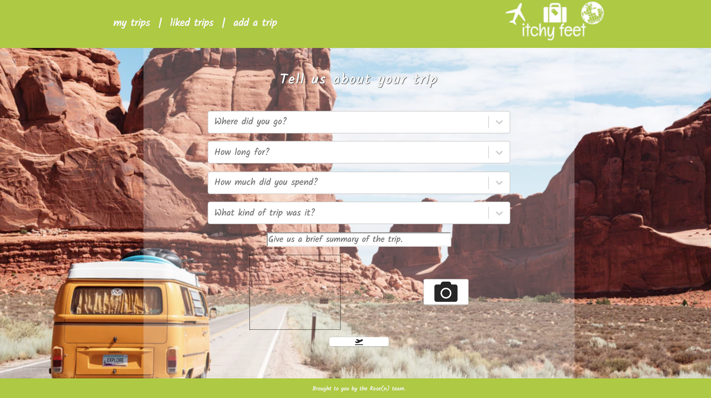
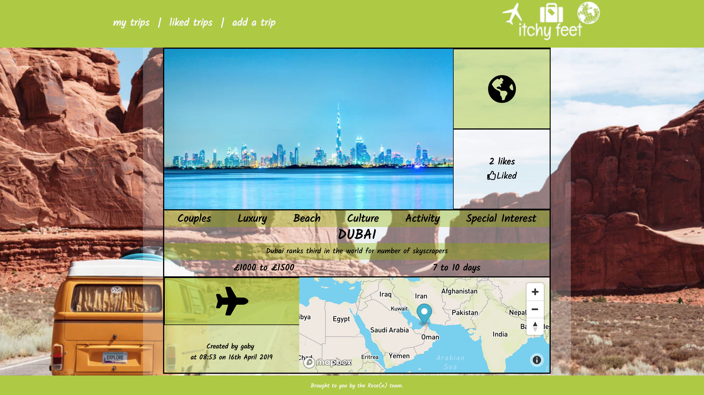
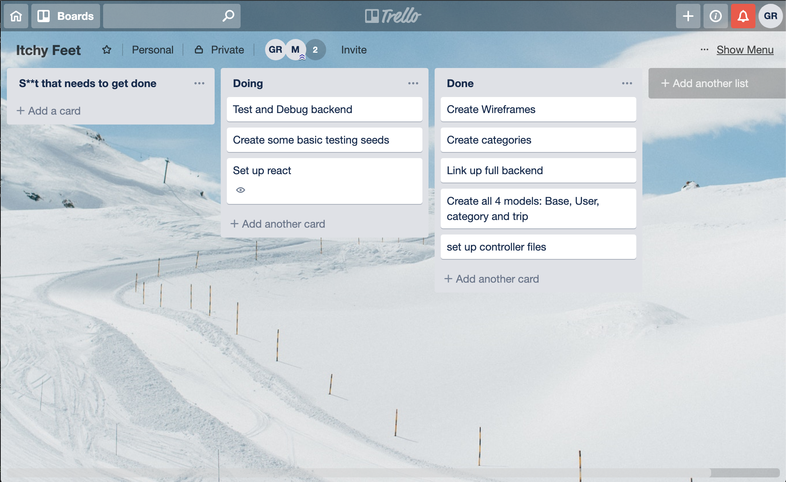
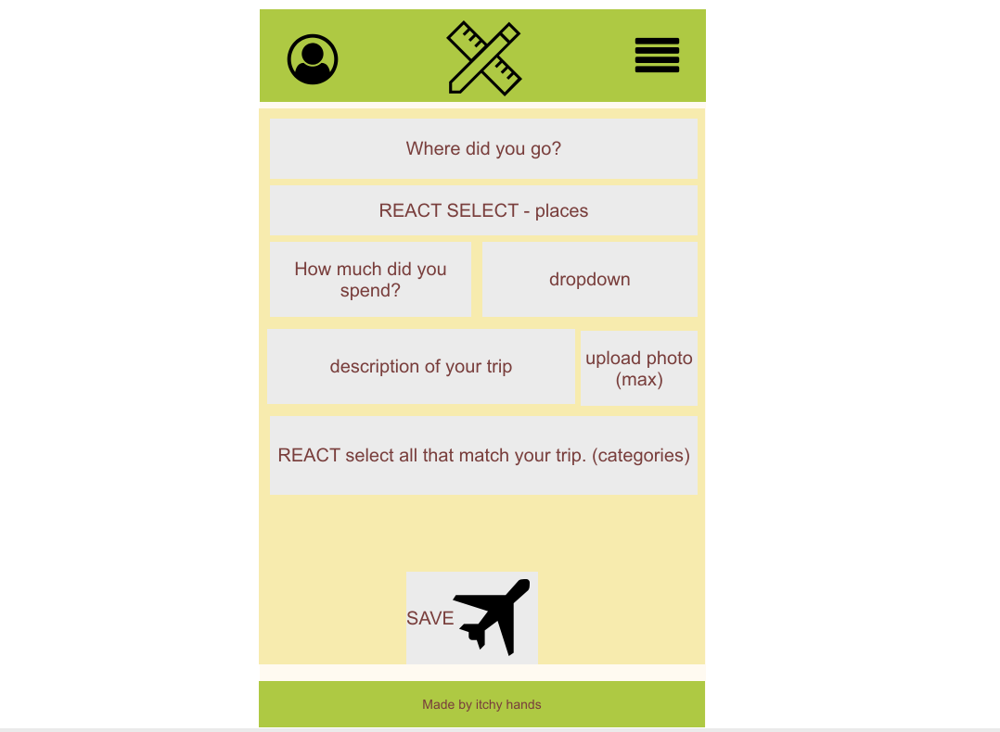

# General Assembly WDI Project 4: A Flask & React App

[Itchy Feet Link](https://itchyfeettravel.herokuapp.com/)

Itchy Feet was my Final Project of the General Assembly Web Development Immersive course. I created it in a pair, and it was the first projects using Python and Flask for the backend and SQL for the database.

---

## Brief

In 1 week, as a pair, we had to:

* **Build a full-stack application** by making your own backend and your own front-end
* **Use a Python Flask API** to serve your data from a Postgres database
* **Consume your API with a separate front-end** built with React
* **Be a complete product** which most likely means multiple relationships and CRUD functionality for at least a couple of models
* **Implement thoughtful user stories/wireframes** that are significant enough to help you know which features are core MVP and which you can cut
* **Have a visually impressive design** to kick your portfolio up a notch and have something to wow future clients & employers. **ALLOW** time for this.
* **Be deployed online** so it's publicly accessible.
---

## Technologies Used:

* JavaScript
* React
* HTML
* CSS / Sass
* Python
* Flask
* SQL
* Mapbox
* Filestack
* Skyscanner flight widget
* Yarn

## Approach Taken

We decided we wanted to create a mobile responsive app that allows you to browse through travel ideas, create posts and save ideas. Using JavaScript/React for the front end and Python/Flask for the back end, we created a web app that did just this. We used a pre-existing location based data dump, instead of an external API to generate location options. We also used Mapbox, and a Skyscanner flight widget for extra features.

In a pair, we coded the initial set up of the models and controllers before splitting and working on separate front end components. We continuously helped each other and cross checked our work. Individually I worked on
the mytrips page, and the wishlist page, as well as the flight widget and some styling.

---

## Screenshot Walk-through

### Landing page for logged-out users prompting register/login.


### Register page that allows user to register their details.


### Login page allows user to login.


### The user's home screen is a newsfeed.


### Adding a trip.



### The user's trips they have created.


### The trips the user has liked.


### This is the trip page, showing the budget, duration, categories, likes, map, and Skyscanner widget when the plane icon is clicked on.



---

### Functionality

The functionality works much the same way as most popular social network sites. Users can:

* Register & login
* Post, edit and delete your own trips
* Like other’s trips and add them to your own wishlist

### Process

1.  Having decided the idea, we set up a Trello board to ensure coordination on all tasks.

2.  To understand the fundamental functioning we worked out the interaction between models.
3.  We then created wireframes for the front end to visualise how our backend would interact with it.

4.  By day 2 we were happy with our planning phase, so set up our backend: creating the models, controllers, and then routes, all in Python.
5.  By day 4 we were happy with the backend set up, having tested it using Insomnia. we then started creating the frontend in JavaScript, made up of various React components and connecting the two.
6.  Having reached an MVP level of completion, we began styling the app and adding in extra features.

#### Featured piece of code 1

The Trip Model was our most complicated model. It contained the majority of the datasets, and had references to other tables using the ForeignKey of the dataset to which it was being linked to.


```
class Trip(db.Model, BaseModel):

    __tablename__ = 'trips_table'

    name = db.Column(db.String(50), nullable=False)
    images = db.Column(db.String(500))
    description = db.Column(db.String(128), nullable=False)
    creator_id = db.Column(db.Integer, db.ForeignKey('user_table.id'))
    budget = db.relationship('Budget', backref='trip_budgets')
    budget_id = db.Column(db.Integer, db.ForeignKey('budget_table.id'))
    duration = db.relationship('Duration', backref='duration_trips')
    duration_id = db.Column(db.Integer, db.ForeignKey('duration_table.id'))
    categories = db.relationship('Category', secondary=trips_categories, backref='trips')
    creator = db.relationship('User', backref='created_trips')
    liked_by = db.relationship('User', secondary=likes, backref='likes')

class TripSchema(ma.ModelSchema):
    categories = fields.Nested('CategorySchema', many=True, only=('name',))
    creator = fields.Nested('UserSchema', only=('id', 'username'))
    liked_by = fields.Nested('UserSchema', many=True, only=('id', 'username'))
    budget = fields.Nested('BudgetSchema', only=('cost'))
    duration = fields.Nested('DurationSchema', only=('duration', 'id'))

    class Meta:
        model = Trip
```

#### Featured piece of code 2

I was pleased with my Wishlist feature, which displayed any trips the user had liked. This was done by using axios to get the users information, and using the likes within the dataset. By mapping the information in this state, we could display information about the trip.
```
class Wishlist extends React.Component {
  constructor() {
    super()

    this.state = { likes: []}
  }
  componentDidMount() {
    axios.get('/api/user', {
      headers: { Authorization: `Bearer ${Auth.getToken()}`}
    })
      .then(res => {
        this.setState({ likes: res.data.likes })
      })
  }

  render() {
    return (
      <main>
        {!this.state.likes && <p> Getting your wishlist</p>}
        {this.state.likes && this.state.likes.map(trip => (
          <div key={trip.id} className="likedtrip-card">
            <Link to={`/trips/${trip.id}`} >

              <div className="likedtrip-title">
                <h1>{trip.name}</h1>
              </div>

              <div className="likedtrip-content">
                <div
                  style={{
                    backgroundImage: `url(${trip.images})`,
                    backgroundSize: 'cover',
                    backgroundRepeat: 'noRepeat'
                  }}
                  className="image-leftside">
                </div>

                <div className="likedtrip-rightcontent">
                  <div className="likedtrip-tophalf">
                    <div className="budget">
                      <h4>{trip.budget}</h4>
                    </div>
                    <div className="duration">
                      <h4>{trip.duration.duration}</h4>
                    </div>
                  </div>

                  <div className="likedtrip-bottomhalf">
                    <div className="contains-categories">
                      <h4>{trip.categories.map((category, i) => (
                        <span key={i}>{category.name}, </span>))}</h4>
                    </div>
                    <div className="contains-like_viewTrip">
                      <h4>{trip.liked_by.length} likes</h4>
                    </div>
                  </div>
                </div>

              </div>
            </Link>
          </div>
        ))}

        {this.state.user && this.state.trips.length === 0 && <p>You dont have any items in your Wishlist yet</p> && <div>
          <Link to="/">
            <button>Check out your newsfeed for inspiration!</button>
          </Link>
        </div>
        }
      </main>
    )
  }
}
```

### Styling

We used CSS and Sass to style Itchy Feet. It gave us more freedom than using a framework and although it took up more time, it gave us the desired outcome and freedom with responsiveness.

---

### Wins and Challenges

Our biggest struggle was using a pre-populated data dump. We couldn't seed our data as we couldn't get the data (set in SQL) to integrate with our Python database, therefore each time we seeded we had to delete our database and create a new one in order to put the information from the data dump into the correct database that could then connect with our front end. This caused big issues and took up far too much time, in hindsight we would have used a public API instead. However we worked with it and you can create trips by selecting the destinations from the data dump.

Overall I am please with the outcome, it looks neat and is fully responsive on mobile. The features that we have work well and it is easy to use and manoeuvre, with features such as liking, maps, flights preset from your location to the destination of your trip and the ability to create and delete trips.

---

## Future Features

If we had more time essential future features we would like to add include:

* Search function for destination, budget, duration and category.
* Friends to see trips other have made.
* A recommendations feature.
* An API for recommendations for the destination chosen.

---

### Key Learnings

I enjoyed working in a pair as you can work together to overcome problems you might face. It also meant we could aim for a slightly more ambitious project in the time we had, which pushed my skills further. It was challenging working in a new language but became more comfortable with Python and SQL over the project. This project taught em to be adaptable with being realistic about targets and shifting the workload between us to reach them, or both working on a problem together to overcome it.
